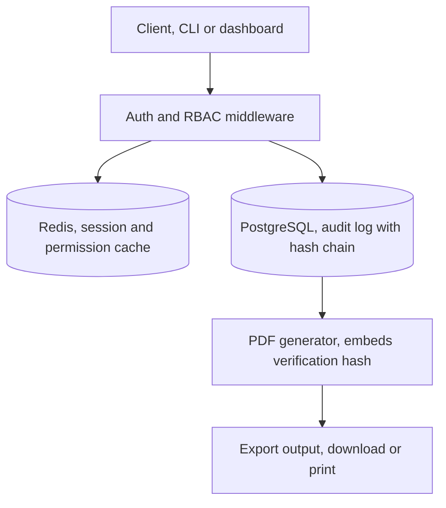

# Custodian

A tamper evident audit trail service with enterprise grade authentication, role based access control, and cryptographically verifiable PDF exports.

## Overview

Custodian is a backend focused service that answers a question every regulated organization eventually asks, can we prove that our records were not altered after the fact. It combines role based access control, cached authorization checks, and a cryptographic hash chain on every audit log entry, so that any exported record can be independently verified as unmodified.

The project is built to demonstrate production grade backend patterns, secure authentication, layered caching, and compliance oriented data export, in a small, focused codebase.

## Features

* JWT based authentication with refresh tokens
* Role based access control with four roles, admin, auditor, operator, and viewer
* PostgreSQL for durable storage, Redis for session and permission caching
* Tamper evident audit log, each entry is cryptographically linked to the one before it
* PDF export of audit trails, with a verification hash embedded directly in the document
* A command line interface for triggering and testing exports, no frontend required to use the core system

## Architecture



A request arrives from either the CLI or, later, a small dashboard. The auth middleware verifies the JWT and checks the caller's role against Redis before ever touching PostgreSQL, keeping authorization checks fast under load. Once authorized, the service queries the audit log, verifies the hash chain for the requested range, and passes the result to the PDF generator, which renders the report and stamps it with the chain's verification hash.

## Security model

Every audit log entry stores a hash computed from its own data plus the hash of the entry immediately before it. This forms a chain from the first record to the most recent one. If any entry is edited, inserted, or deleted after the fact, the chain breaks at that point and verification fails. When an export is generated, Custodian walks the chain for the requested date range and reports its status, verified or broken, directly on the PDF, so the exported document carries its own proof of integrity rather than relying on trust in the system that produced it.

## Tech stack

* Language, Go
* Database, PostgreSQL
* Cache, Redis
* PDF generation, gofpdf or maroto
* CLI framework, Cobra
* Containerization, Docker Compose

## Getting started

### Prerequisites

* Go, version 1.22 or later
* Docker and Docker Compose
* Make, optional, for convenience commands

### Installation

1. Clone the repository
2. Copy the example environment file, `cp .env.example .env`, and fill in the values
3. Start the stack, `docker compose up`
4. Database migrations run automatically on startup

## Configuration

The service is configured entirely through environment variables.

* `DATABASE_URL`, connection string for PostgreSQL
* `REDIS_URL`, connection string for Redis
* `JWT_SECRET`, secret key used to sign access tokens
* `JWT_EXPIRY`, access token lifetime, in minutes
* `PORT`, port the API listens on

## Usage

Once the stack is running, the CLI can trigger an export directly, without any frontend involved.

```
custodian audit export --from 2026-01-01 --to 2026-06-30 --format pdf
```

Other planned commands include user creation, role assignment, and chain verification without a full export.

## Roadmap

* A small React dashboard for triggering exports and viewing audit history visually
* Finer grained, per resource permissions rather than role only checks
* Optional email delivery of scheduled exports
* Multi tenant support, so the service can host more than one organization's audit trail

## Project status

Actively in development. Core authentication, caching, and the audit export pipeline are the current focus, with the dashboard and additional CLI commands to follow.

## License

MIT License. See the LICENSE file for details.

## Author

Built by Kevin, a software engineering and data science student based in Nairobi, Kenya.
